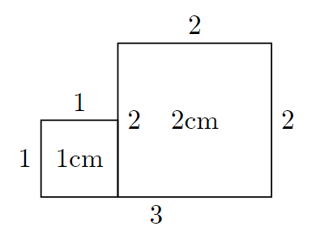
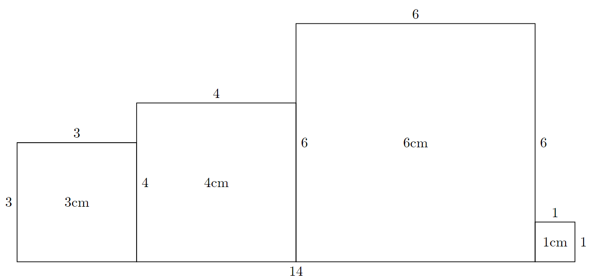

# Fondamentaux de la programmation - Concours d'algorithmique

## Exercice 1 - Le Shaker (2021) - Une histoire de couleur

Nous voilà à la première épreuve : la peinture. Gérard a oublié de commander la peinture. Il a pu trouver des restes dans son cabanon de jardin, mais ce n'est pas suffisant pour les besoins du concours et des artistes. 

Il aurait pu changer le thème du concours en concours d'art minimaliste, mais non, parce que Gérard est ambitieux. 

Ainsi, il vous demandera de développer un mélangeur de couleurs, un calculateur pour prévoir à l'avance les couleurs mélangées par les artistes. 

Dans le but d'éviter les mélanges inutiles et donc le gaspillage de peinture, votre mission est donc de calculer la couleur moyenne issue d'un mélange de deux couleurs `C1` et `C2`. 

Les couleurs sont des entiers compris entre 0 et 255. 

Le résultat sera toujours entier et arrondi à l'entier supérieur si nécessaire.

```python
from math import ceil # ceil est une fonction qui permet d'arronde à l'entier supérieur
def shaker_2021_exo_1(c1, c2):
    """Retourne la couleur moyenne entre c1 et c2
    :param c1: (int)
    :param c2: (int)
    :return: (int) la couleur moyenne
    """
```

**Exemple**

```python
>>> shaker_2021_exo_1(255, 0)
128
```

**Commentaire**

Ici, la moyenne des deux couleurs est 127.5, on l'arrondit ainsi à 128.

## Exercice 2 - Le Shaker (2021) - Gros tas de bouquins

Nous voilà à la deuxième épreuve, l'épreuve de littérature. Les participants ont dû écrire un livre sur le thème de leur choix, mais dans un temps imparti.

Face à la pile de livres grandissante et pour éviter un burn-out du jury (dont Gerard Traquenard), ces derniers ont décidé de s'imposer un temps de lecture limité.

Le jury de cette épreuve est composé de trois membres.

Chaque membre a une spécialité et ne juge que sa spécialité, et dispose d'un temps limite pour juger les livres. Il vous est donné le temps de lecture et le type pour chaque livre, vous devez indiquer si chaque jury aura le temps de lire tous les livres de sa spécialité.

**Entrée**

* 3 entiers ` TF `, `TP` et `TA`  les temps donnés en minutes pour chaque jury, respectivement pour la catégorie de romans Fantastique (`F`), Policier (`P`), et Autre (`A`). 
* Une liste de livres où un livre est un tuple qui est composé de : 
    * une lettre représentant le genre de roman (`F` pour fantastique, `P` pour policier, `A` pour autre)  
    * un entier `t` représentant le temps en minutes nécessaire pour le lire.
    *Note:* Un tuple est une sorte de liste, tout ce que vous connaissez des listes s'applique aux tuples. La seule différence est qu'un tuple ne peut pas être modifié.
    Vous pouvez accéder aux informations des livres avec les fonctions `genre(livre)` et `temps_lecture(livre)` (ou encore `livre[0]` et `livre[1]` mais cela est moins clair).
    
```python
def genre(livre):
	return livre[0]
def temps_lecture(livre):
	return livre[1]

livres = [("F", 20), ("P", 15)]
for livre in livres:
	print(genre(livre), " et ", temps_lecture(livre))
```

**Sortie**

Un booléen indiquant si le jury a le temps de lire tous les livres.

```python
def shaker_2021_exo_2(TF, TP, TA, livres):
    """Test si le jury aura le temps de lire tous les livres de leur catégorie
    :param TF: (int) Temps pour le jury Fantastique
    :param TP: (int) Temps pour le jury Policier
    :param TA: (int) Temps pour le jury Autre
    :param livre: (list) Liste des livres
    :return: (bool) True si le jury a le temps de lire tous les livres, False sinon"""
```

**Exemple**

```python
>>> shaker_2021_exo_2(50, 50, 50, [("F", 20), ("P", 15), ("F", 30), ("A", 40), ("P", 7)])
True
```
**Commentaire**

Dans cet exemple, chaque membre du jury dispose de 50 minutes de lecture pour sa catégorie.

* Le jury pour le fantastique a 20 + 30 = 50 minutes de lecture
* Le jury pour le policier a 15 + 7 = 22 minutes de lecture
* Le jury pour les autres a 40 minutes de lecture 

Ils ont tous 50 minutes ou moins de temps de lecture, donc la réponse est `True`.

## Exercice 3 - Orange (2021) - La ferme familiale

Ce matin en lisant votre courrier, vous recevez une lettre peu habituelle : vous apprenez que vous avez hérité d'une lointaine grand tante une **grande ferme familiale** quelque part en Bourgogne. Depuis plusieurs mois vous ne rêviez que de vous échapper de votre train-train urbain : c'est décidé, vous allez dès demain vous installer en Bourgogne pour **reprendre la ferme** !

Une fois arrivé devant la ferme, vous vous sentez déjà chez vous. Il faudra remettre un peu d'ordre mais l'activité pourra vite reprendre. Première étape : les lettres affichant le nom de la ferme sont tombées et vous voulez les réaccrocher. Les lettres sont tombées sur deux tas différents, il semble qu'il suffise simplement d'alterner les lettres de chaque tas pour retrouver le nom de la ferme.

Ecrivez une fonction `entrelacement(mot_1, mot_2)` qui à partir de 2 suites de lettres retourne une chaîne de caractère combinant alternativement les lettres des 2 suites.

```python
def entrelacement(mot_1, mot_2):
    """Retourne une chaîne de caractère qui correspond à l'entrelacement des chaînes <mot_1> et <mot_2>
    :param mot_1: (str)
    :param mot_2: (str)
    :return: (str) l'entrelacement des chaînes <mot_1> et <mot_2>
    """
```

**Exemple**

```python
>>> entrelacement("jri", "adn")
"jardin"
>>> entrelacement("vreem", "etfre")
"verteferme"
```

## Exercice 4 - Orange (2021) - Pré carré

La ferme a désormais bien plus d'allure ! Vous pouvez vous mettre au travail. Vous voulez profiter de ce début d'hiver pour refaire les haies autour de vos parcelles. Vous souhaitez déterminer quelle sera la longueur totale de haie que vous aurez à planter.

En regardant le plan vos parcelles semblent plutôt ordonnées : chacune d'elle est un carré, et le côté sud de chaque parcelle est aligné. Il ne vous manque que la liste des différentes largeurs de chaque parcelle.

A partir de cette liste de largeurs, écrivez un programme qui renvoie la distance de haie que vous aurez à planter.

**Entrée**

Une liste de `N` entiers compris entre 1 et 100, représentant dans l'ordre la largeur de chaque parcelle

**Sortie**

Un entier représentant la longueur totale de haie qu'il est nécessaire de planter pour délimiter toutes les parcelles.

**Attention** : veillez à ne planter qu'une seule fois la haie là où les parcelles se touchent.

```python
def longueur_haie(parcelles):
    """Retourne la longueur totale de haie à planter pour délimiter les parcelles.
    :param parcelles: (list)
    :return: (int) la longueur totale de haie à planter pour délimiter les parcelles.
    """
```

**Exemple 1**

```python
>>> longueur_haie([1, 2])
11
```

**Commentaire**



La longueur de la haie sera donc de 1 + 1 + 2 + 2 + 2 + 3 = 11. Remarquez que le coté joint du carré de 1cm et 2cm ne compte que pour 2cm de haie et non 3...

**Exemple**

```python
>>> longueur_haie([3, 4, 6, 1])
48
```

**Commentaire**



La longueur de la haie sera donc de 3 + 3 + 4 +4 + 6 + 6 + 6 + 1 + 1 + 14 = 48

## Exercice 5 - Battle Dev (2021) - Décollage !

**3, 2, 1... Décollage !**

Ça y est, vous y êtes. Dans moins d'une minute la fusée décollera et vous rentrerez dans l'Histoire. Tous les journaux titraient déjà ce matin "Tommy Pasqua, vers l'infini et au-delà !".
Le compte à rebours commence : **10... 9... 8...**. Mais gros trou de mémoire, impossible de vous souvenir du bouton pour décoller ! Heureusement vous vous souvenez d'une chose : parmi tous les boutons, c'est le seul qui apparaît **exactement 2 fois**.

À partir de la liste des boutons, écrivez un programme renvoyant le bouton qui fera décoller la fusée.

**Entrée**

Une liste de chaînes de caractères en lettres minuscules indiquant le nom d'un bouton.

**Sortie**

Le nom du boutons apparaissant exactement 2 fois dans la liste.

```python
def decollage(boutons):
    """Retourne l'élément qui apparait EXACTEMENT 2 fois dans la liste
    :param boutons: (list)
    :return: (str) l'élément qui apparait EXACTEMENT 2 fois dans la liste"""
```

**Exemple**

```python
>>> decollage(["rocket", "boosters", "rocket", "boosters", "fire", "rocket")
"boosters"
```
